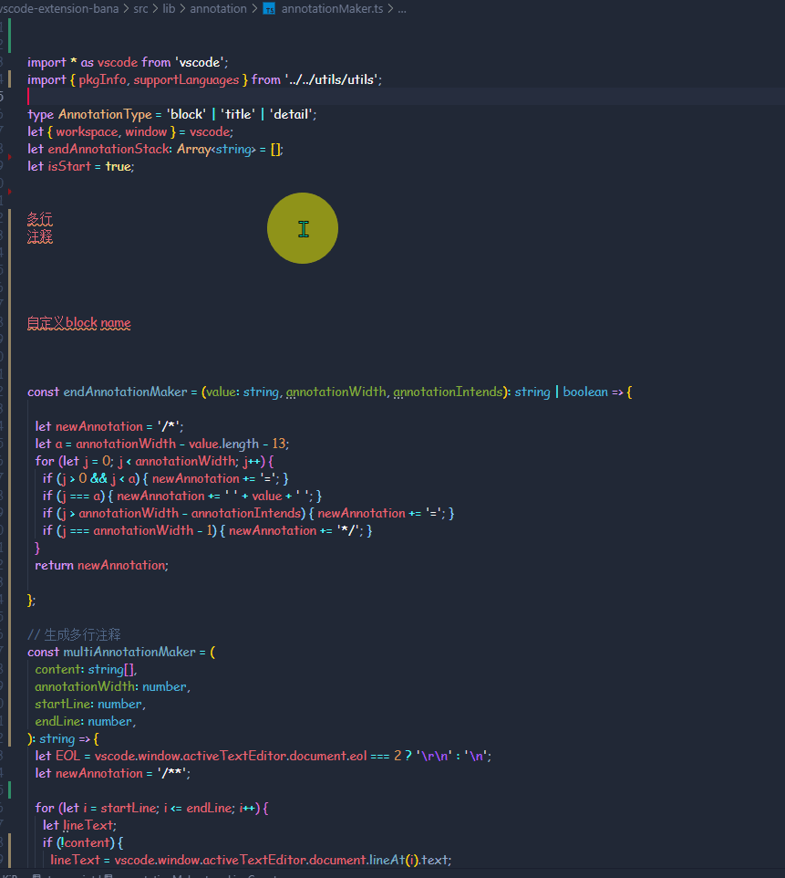
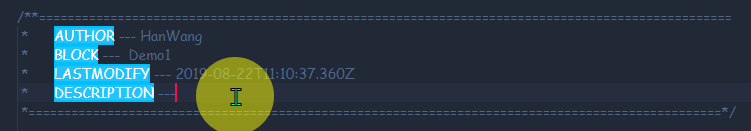

# 彼岸花工具插件 vscode 插件

## 使用方法

**适用于 js/ts,  光标所在行会自动 识别 参数 当然也可以选择**

1. `ctrl+alt+]` 将函数和类按块注释 需要 package.json 生成代码修改信息 
2. `ctrl+alt+d` 多行注释
3. `ctrl+alt+t` 生成文件详情注释 你需要在package.json 中定义author, license, repository 字段



1. `ctrl+alt+[` 打印变量或参数 第一次暂存参数, 移动光标 放到合适位置, 在按一次


## 设置

```json
{
  "bana.enable":  true // 开启bana
  "bana.annotation.enable": true // 开启注释
  "bana.annotation.width": 100, // 注释宽度
  "bana.annotation.intends": 6, // 注释到内容的距离
}
```
这个怎么解决 



